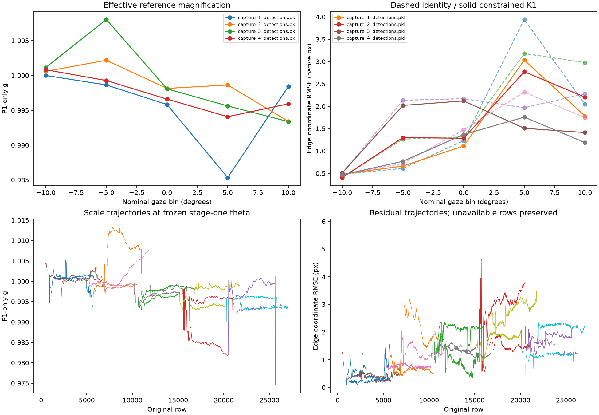

# Stage 2 results

**S2/G2 complete — GO_WITH_LIMIT. Proceed to S3/G3.**

P1 now supplies one positive, gaze-conditioned GLS scale from its four correlated edge coordinates. The conditional fit uses an empirical fixed-axis reference, two shared deformation coefficients, vectorized arrays and parallel reference/block fits.

| Result | Value |
|---|---:|
| Reviewed schedule | 100,090 frames / 20 exposures / captures 1–4 |
| Valid frames with positive exported scale | 89,175 / 89,175 |
| Unavailable original inputs | 10,915 |
| Matched identity → K1 native edge RMS | 1.9266 → 1.5908 px |
| Matched objective cost | 2263.0413 → 1921.1985 |
| Exported g range | 0.97048–1.01333 |
| Checks | 31 passed, zero failures/errors/skips |
| Total CPU experiment time | 12.75 s |

The operational reference is capture 1 nominal −10°, omega1 −10.020904°. Its observed balance minimum is at an endpoint. Physical source symmetry, optical zero and optical origin are unknown. An adjacent −5° reference changes scale by 0.0265–0.1550% and reverses the fitted keystone sign. Keep these uncertainties for G5/G7/G8. Residuals remain structured across capture/gaze, and transferred centroid gaze is still approximate.

One bootstrap refresh uses mean framewise displacement/g; exported scale and P1 means are recomputed at the refreshed per-frame theta. This is an initialization checkpoint. Full joint calibration, P4 common-scale compatibility and independent accommodation accuracy remain outstanding.

The first attempt stopped above the fixed gradient certificate. One numerical repair added bounded stationarity polishing without changing the optical model or tolerance. Both starts and all five block fits now certify conditionally.

- [Full audit, all twenty conditions and limitations](../results/attempt_02/STAGE_REPORT.md)
- [Checkpoint](../results/attempt_02/checkpoint.json)
- [Attempt ledger](STAGE_REPORT.md)
- [Next action and resume pointer](PROGRESS.md)
- [Runner and reproduction instructions](../README.md)
