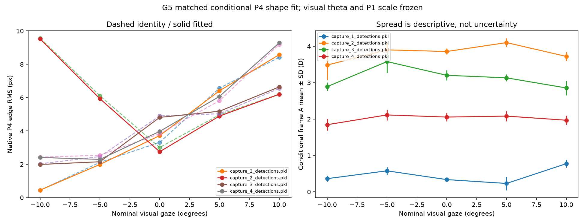

# Stage 3 results

**G3, G4 and G5 complete — GO_WITH_LIMIT.** The implementation can initialize the next relative-center/joint calculation; optical accuracy remains unresolved.

| Result | G4: near-reference baseline | G5: all-frame composed map |
|---|---:|---:|
| Effective m1 /D | −0.01682546 | −0.01907793 |
| Conditional A states solved | 16,644 | 89,175 |
| Native edge RMS comparison | 9.2549 → 1.9228 px (near window) | 5.3764 → 5.3885 px (matched full population) |
| Weighted conditional cost | 14.5145 | 48.5801 → 44.8573 |
| Passing checks | 50 | 55 |
| CPU runtime | 11.33 s | 69.13 s |

G4 finds a coherent negative effective P4 size response against recorded demand, with dynamic A under soft full-fixation mean anchors. Its slope magnitude changes about **28%** under the retained reference alternative. Capture and pose remain confounded with demand.

G5 composes accommodation and gaze keystone correctly and updates all complete-frame A. It decreases weighted cost **7.66%**, while native RMS rises **0.23%**: **a tradeoff between the weighted criterion and native pixel RMS**. Structured signed residuals remain. There are 961 lower-bound A states, mostly at capture1 +5°, and several fixation means differ substantially from demand. These are provisional state/model limitations.

All 100,090 scheduled rows, 20 exposures and 300,270 expected slots remain; 10,915 rows have unavailable original inputs. G2 visual theta/P1 scale and independent G3 reference remain frozen. Both identity and composed K4 snapshots are saved.

Next: **S6/G6 corrected centers and forward D polynomial**, followed by full joint refinement at G7 and whole-loop agreement at G8. Full optical calibration and independent physiological accommodation accuracy are still outstanding.

- [G4 measured-response results](RESULTS_G4.md) and [full G4 audit](../results/g4_attempt_01/STAGE_REPORT.md)
- [Full G5 audit, all twenty conditions and limitations](../results/g5_attempt_01/STAGE_REPORT.md)
- [G5 checkpoint](../results/g5_attempt_01/checkpoint.json)
- [Gate ledger](STAGE_REPORT.md) and [resume pointer](PROGRESS.md)
- [Runner/reproduction instructions](../README.md)
