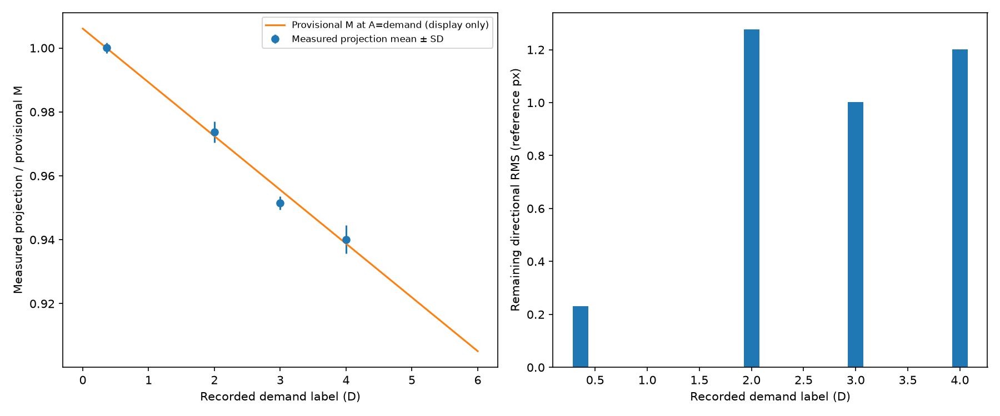

# G4: accommodation baseline initialization

**COMPLETE, GO_WITH_LIMIT.**

The measured near-reference P4 projection decreases from approximately 1.000 at 0.36 D to 0.940 at 4 D. DM0-M1 fits one effective slope **−0.01682546/D**, with individual near-reference A free under soft full-fixation mean anchors.

- Native near-reference edge RMS: **9.2549 → 1.9228 px**.
- 16,644 near-window A states solved; 72,531 outside-window starts remain provisional.
- 17 lower-bound A states; no all-bound fit.
- **50 checks passed**; runtime **11.33 s** on vectorized CPU.
- Doubling the soft-anchor scale changes slope little. The adjacent reference gives **−0.02152827/D**, about 28% larger magnitude.

This is a conditional shape initialization. Capture/pose and demand are confounded; the physical reference and accommodation accuracy remain unresolved. Directional residuals persist. G5 revisits individual local angles and fits the P4 gaze deformation on all complete frames.

[Full audit, population table and limitations](../results/g4_attempt_01/STAGE_REPORT.md) · [Checkpoint](../results/g4_attempt_01/checkpoint.json)
