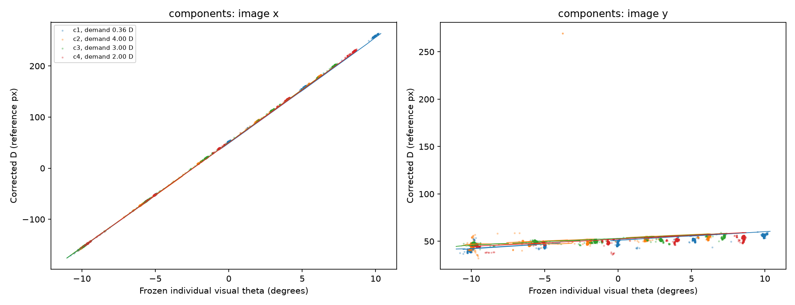

# Stage 4 results

**G6 completed: GO_WITH_LIMIT. G7 attempt 02 completed uncertified and is PAUSED.** The forward center polynomial remains a conditionally usable initializer; the full joint model is not certified. Attempt 01 is preserved as the historical unbounded fit.

| Evidence | G6 result |
|---|---:|
| Complete frames evaluated | 89,175 |
| Unavailable scheduled rows retained | 10,915 |
| Forward visual-gaze degree | 2 |
| Conditional coefficient rank | 10 / 10 |
| Scaled coefficient gradient | 6.49e−11 |
| Full fixed-state objective | 54,759.435 → 2,134.092 |
| Equal-exposure relative-coordinate RMS | 72.071 → 4.561 px |
| Final centroid-coordinate RMS | 4.894 px |
| Final attempt CPU runtime | 7.51 s |

The before value uses an optimal **constant D initializer**, with the remaining degree-2 coefficients initially zero. Both values use the complete ten-coordinate residual and the same covariance, frames, fixed states, optical predictions and anchors. This comparison measures the center block's contribution. G5 used a different conditional shape criterion; its cost is not comparable to these values.

The dominant center response is approximately **20.55 reference px per visual degree in image x**, with **0.895 reference px per degree in image y**. Image y is an image response to the same gaze state. There is no vertical gaze state. Curvature and accommodation terms remain in the prescribed degree-2 family; no additional spatial freedom was introduced.

Optical means affect the measured centroid law. Their mean correction is mainly in image y, reaching approximately −4.02 reference px in the recorded conditions. The implementation applies that correction once, preserving the P4-minus-P1 sign. All-frame centroid/sign/origin identities and agreement with the existing complete forward adapter are within 2.85e−13 px.

## What remains unresolved

Structured point and centroid residuals persist, including transition tails. Capture2 −10° has 14.76 px centroid-coordinate RMS over its full interval. Provisional gaze means differ from nominal targets by as much as **3.885°**; G5's accommodation bounds and mean-demand differences remain. G6 keeps every theta/A/g value unchanged and cannot resolve those state limitations.

The polynomial is identifiable at the frozen snapshot, with normalized data-curvature condition number 57.26. Its rank does not establish physical center origins, physiological gaze/accommodation accuracy, or joint identifiability after the optical parameters are released. Reference ambiguity, capture-demand confounding, and G5's weighted/native tradeoff remain open.

No automated tests were added or run for G6. Current evidence consists of independent reconstruction of the actual empirical run, analytical synthetic cases in the audit, and historical upstream contracts. The historical 55-test result is not reported as a current G6 test result.

At the G6 review, the next action was G7 full DM0 joint refinement. Attempt 01 used the unbounded center-accommodation law and was later excluded by the user-authorized physical bound; it remains immutable historical evidence.

- [Detailed G6 audit and analytical cases](../results/g6_attempt_02/STAGE_REPORT.md)
- [All 20 exposure records and 100 contiguous blocks](../results/g6_attempt_02/conditions.json)
- [Complete native-row arrays and correction ledger](../results/g6_attempt_02/fitted.npz)
- [Independent reconstruction](../results/g6_attempt_02/reproduction_checks.json)
- [Resume pointer](PROGRESS.md) and [runner instructions](../README.md)

## G7 full joint refinement — attempt 01 (historical unbounded model)

G7 used all 89,175 complete valid rows from the twenty reviewed intervals; 10,915 unavailable rows remain scheduled. It used two dynamic states per valid frame, the full ten-coordinate raw covariance, equal full-exposure weights, fresh P1-only scale, the finite 0.10°/0.25 D full-mean anchors, zero temporal penalty, and the declared shared priors. The 19 free globals were a trace-free P1 pair plus gamma1, M1, three constrained P4 template shape coordinates, three K4 terms, and ten degree-2 center coefficients. Independent omega1 and omega4 remained fixed at empirical operational references. Omega1 continuous uncertainty is unquantified; G3 discrete alternatives and physical zeros remain unresolved.

| Start | J | Point | Theta anchor | A anchor | Prior | Scaled state gradient∞ | Scaled global gradient∞ | Local negative eigenvalues | Fit certified |
|---|---:|---:|---:|---:|---:|---:|---:|---:|---|
| Common | 1,522.256449 | 1,251.101768 | 263.307547 | 7.652159 | .194975 | .24935 | 507.554 | not independently censused | No |
| Perturbed, selected | 1,516.074461 | 1,239.875051 | 268.343358 | 7.627808 | .228244 | .63411 | 671.004 | 214 | No |

Both starts completed 12 outer cycles and each recorded 144 accepted updates plus one unaccepted observed-curvature polish proposal. The history does not record an exact rejection reason; the final certificate and separate curvature census show nonpositive free local curvature. The selected snapshot has 3,994 accommodation-bound states, no theta-bound states, no globals at bounds, valid P1/P4 domains, and data rank 2 for all rows. The serialized profile rank 0 is a sentinel after local curvature blocked Schur elimination, not evidence of global rank deficiency. Among 174,361 free local state dimensions, 214 observed eigenvalues are negative: exposure 6 has 168, exposure 17 has 21, exposure 7 has 14, exposure 2 has 10, and exposure 11 has 1. The rank-2 mean-anchor update cannot remove more than two negative directions within an exposure group. This is a numerical diagnosis target, not evidence of accommodation-law failure.

The predeclared progress-only compact schedule contains 100 rows and 300 held-point slots. At the selected final snapshot, 270 slots have retained inputs, 30 are unavailable, 267 retained-only inferences are individually certified, 3 are unresolved, and 267 are scored; the native progress RMS is 28.3941 px. This is not the G8 score and does not certify the global fit. Refined theta means remain displaced from several nominal targets, and fitted A means vary with nominal gaze within captures; these remain unresolved state/optical tradeoffs, not physiological estimates. Across both starts the objective decreased roughly 29% from the compatible initial value, while equal-exposure native relative RMS increased from 4.560659 to 4.985584 px (about 9.3%). That tradeoff does not establish physiological accuracy or law failure.

Independent NumPy reconstruction from saved states and globals reproduces valid-row predictions within 3.41e−13 px and g within 6.66e−16; objective components and full fixation means also reproduce. The G5/G6 parent hashes and original G7 source snapshot hashes match. Runtime was 156.785 s including backend checks, compact inference and reporting; CPU maximum RSS was 1,112,944 KiB. GPU memory and pool numbers are final snapshots, not peak measurements. The 40-frame same-equation CPU/GPU derivative audit passed; no automated test suite ran.

### Frozen center accommodation sensitivity

A post-fit comparison of frozen G6 and selected G7 models evaluates \(H(\theta,A)=D+\mu_4-\mu_1\) at \(g=1\), \(A=0\) and 4 D, and visual theta from -10° to 10°. G6 ΔHx spans 0.612 to 2.865 px. G7 ΔHx spans +33.325 to -635.873 px, while ΔHy spans +13.336 to -13.269 px. The G7 local-equivalent horizontal shifts are +0.621, -3.251, -10.478, -28.760, and -166.005° across theta -10°, -5°, 0°, 5°, and 10°; these are local linear ratios, not inverse estimates. G7's horizontal theta slope reverses sign between the reference accommodation and 4 D at theta 0°, 5°, and 10°.

The selected uncertified G7 center coefficients have \(b_{A,x}=-75.317\) px/D and \(s_{A,x}=-83.648\) px per D·(theta/10), versus G6 values 0.436 and 0.283. This is a pronounced center accommodation/gain tradeoff in the frozen G7 snapshot. The user-supplied 50 arcmin (0.833°) expectation was not found in the authority documents; it is not treated as a validated bound or fit constraint. See [comparison data](../results/g7_attempt_01/centroid_accommodation_comparison.json) and [calculation script](../scripts/compare_centroid_g6_g7.py).

External simulation data inventory: [distortion-tracking source evidence](DISTORTION_TRACKING_EVIDENCE.md). The separate uncentered chief-ray NPZ named by that repository is not present, so the committed center-ray-relative grids do not verify an absolute-center or 50-arcmin bound.

**Decision: PAUSE.** Full fit, certification, cross-check and comparison remain false; G8 is not authorized. Diagnose nonpositive curvature and large joint trust caps, starting with exposure 6 and its outlier/transition rows, and review this center accommodation/gain tradeoff against an authoritative source before considering any compatible continuation.

- [G7 detailed attempt report](../results/g7_attempt_01/STAGE_REPORT.md)
- [G7 checkpoint and full arrays](../results/g7_attempt_01/checkpoint.json), [fitted.npz](../results/g7_attempt_01/fitted.npz)
- [G7 mechanical reconstruction and curvature census](../results/g7_attempt_01/mechanical_audit.json)
- [Native P4-local-angle response](../results/g7_attempt_01/response_curves_native_xi4.png)

## G7 attempt 02 — user-authorized one-degree horizontal bound

Attempt 02 is the current G7 result. It ran two fresh starts for 32 outer cycles each on all 89,175 complete valid rows. The 10,915 unavailable rows remained scheduled. The common start ended at J=1925.827635; the selected perturbed start ended at J=1925.601339, down 9.77% relative to the G6 parent objective J=2134.091666. The selected objective components are point 1880.990476, theta anchor 43.004635, A anchor 1.581828, regularization 0.024400 and temporal 0. Equal-exposure native relative-coordinate RMS is 4.678851 px, compared with 4.560659 px at G6. Fixation-mean theta residual RMS against nominal labels is 0.9274° (2.31665° in unbounded attempt 01); this is label agreement, not proof of gaze accuracy.

The user explicitly authorized a one-degree bound on horizontal accommodation-induced apparent gaze shift without another raw optical export. For \(H_x=D_x+\mu_{4,x}-\mu_{1,x}\) at \(g=1\), the fit enforces \(H_{x,\theta}\ge s_{min}\) and \(|H_{x,A}|\le s_{min}/4\), with \(s_{min}=10.0270\) reference px/degree from half the G6 outward-interval lower slope. Interval constraints span \(\theta\in[-20,20]\) degrees and \(A\in[0,6]\) D; over A=0 to 4 D they imply at most a one-degree inverse-equivalent displacement where the monotone inverse lies in the declared theta domain. This is a user-assumed coupling bound, not a measured optical calibration, and does not clamp theta labels or bound individual gaze errors. The selected continuous certificate is feasible with 5,760 inequalities and minimum normalized slack 3.71e−14; three constraints are active. Dense public-optics checks at 81 theta samples show a maximum 0-to-4 D horizontal shift of 10.02635 px, within the 10.02700 px envelope.

Numerical certification fails independently in two ways. The selected state projected gradient is 1.20e−9 and complementarity is 3.12e−12, but the scaled global KKT residual is 2.8122e−4, above the 1e−6 limit. The two-step active-constraint curvature agreement is 0.4508 versus a 0.01 limit, so constrained profile curvature was not evaluated. The common start also fails: global KKT residual 255.1908 and curvature agreement 0.4476. A separate census finds zero negative eigenvalues among 169,935 free local state eigenvalues (minimum 0.0012189); this does not establish coupled profile curvature. No global rank deficiency is inferred.

The predeclared progress-only compact schedule contains 300 slots: 270 are retained-valid and individually certified, 30 unavailable, none unresolved; final native progress RMS is 29.3673 px. This does not certify the shared fit and is not a G8 score. Both starts completed their declared budgets; common accepted 359/390 updates and perturbed 358/390. Their histories record many infeasible physical-bound line-search proposals (4,725 and 5,804) and 30 nonpositive shared proposal-curvature events each. Runtime was 782.62 s; CPU max RSS was 974,220 KiB. GPU and memory-pool values are final snapshots, not peaks.

Independent NumPy reconstruction reproduces objective components within 4.55e−13, predictions within 3.98e−13 px, g within 8.88e−16, and fixation means within 2.49e−14. Parent and archived source hashes match. The live fitting module and bounded runner were restored byte-for-byte from the source snapshot used for the attempt. No automated tests were added or run.

**Current decision: PAUSE / COMPLETE_UNCERTIFIED.** Keep fit, cross-check and comparison flags false; G8 is not authorized. The next numerical question is why the active interval-constraint Hessian is unstable near the boundary and whether a smooth equivalent certificate can retain the same physical bound and unchanged objective. Resolve that numerical question before another fit; keep G8 paused.

- [Detailed attempt 02 report](../results/g7_attempt_02/STAGE_REPORT.md)
- [Mechanical reconstruction, full population and history census](../results/g7_attempt_02/mechanical_audit.json)
- [Attempt 02 checkpoint and arrays](../results/g7_attempt_02/checkpoint.json), [summary](../results/g7_attempt_02/summary.json), [fitted.npz](../results/g7_attempt_02/fitted.npz)
- [Attempt 02 provenance and source snapshot](../results/g7_attempt_02/provenance.json)
- [Preflight interval and CPU/GPU proposal evidence](../results/preflight_1degree/preflight.json)
