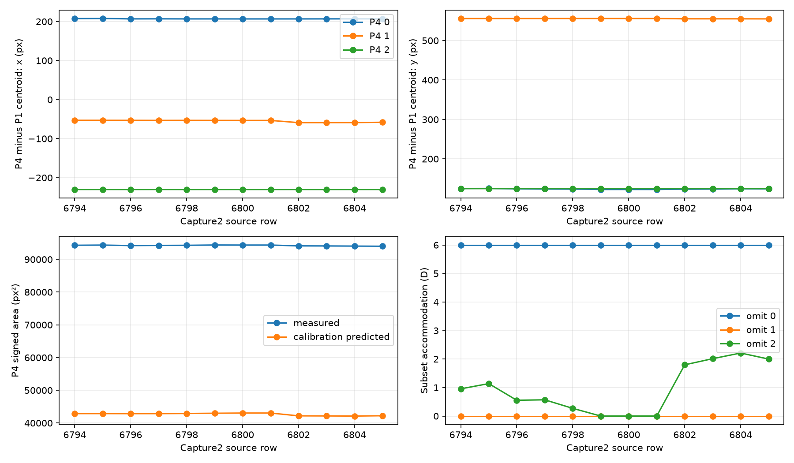
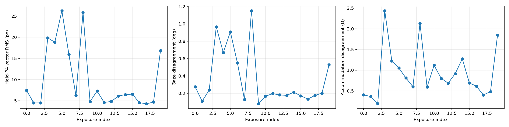

# G8 full frozen-model evaluation

**Status: computed and independently reconstructed; pending root scientific review.**

Primary complete triples: 89175 across 20/20 exposures. All 300270 scheduled slots are retained.

| Metric | Equal-exposure result |
|---|---:|
| E, held-P4 vector RMS | 12.4085 px |
| Gtheta, same-frame state disagreement | 0.477866 deg |
| GA, same-frame state disagreement | 1.10172 D |

Pooled per-frame medians and tails are saved separately in [native_frame_distributions.json](native_frame_distributions.json); they use pooled frame weighting, whereas the primary RMS uses equal exposure weighting.

## Coverage and native errors by omitted point

| Omitted P4 | Scheduled | Inferred | Scored | Bound scored | Vector median / p95 / p99 (px) | x / y bias (px) | x / y RMS (px) |
|---:|---:|---:|---:|---:|---|---|---|
| 0 | 100090 | 89175 | 89175 | 11224 | 5.43959 / 11.2517 / 14.0858 | -1.44382 / 1.3826 | 6.96109 / 6.14078 |
| 1 | 100090 | 89215 | 89175 | 8948 | 5.97717 / 37.2896 / 49.0582 | -2.34625 / -0.099086 | 15.7093 / 8.30462 |
| 2 | 100090 | 89175 | 89175 | 20809 | 4.42239 / 11.18 / 14.1848 | -2.80339 / 0.288475 | 5.69626 / 6.05905 |

## Same-timestamp application comparison

The predeclared schedule has 110 rows; 100 all-three inverses are certified and unambiguous. Calibration states have full-exposure anchors; application inversions are label-free.

| State comparison | Matched rows | Equal-exposure theta RMS difference (deg) | Equal-exposure A RMS difference (D) |
|---|---:|---:|---:|
| All-three minus calibration | 100 | 0.0402032 | 0.0713189 |
| Omit 0 minus all-three | 100 | 0.0369406 | 0.70661 |
| Omit 1 minus all-three | 100 | 2.92557 | 1.04813 |
| Omit 2 minus all-three | 100 | 0.179739 | 1.23879 |

## Retained-pair conditioning at the same all-three state

Ratios compare conditional accommodation information after allowing gaze, using the declared covariance marginals. They describe the weighting metric and do not establish physical precision.

| Omitted point | Conditional A information fraction: median / p05 | Absolute column cosine median / p95 |
|---:|---|---|
| 0 | 0.448686 / 0.44844 | 0.266285 / 0.268911 |
| 1 | 0.498404 / 0.490328 | 0.35953 / 0.376424 |
| 2 | 0.0791869 / 0.0772588 | 0.816371 / 0.821505 |

## Measurement diagnostics

0 of 89175 complete measured P4 triangles have a signed-area orientation different from the frozen positive-domain model. Inspect measurement noise, detection and correspondence before attributing this to optical coefficients.

The predeclared capture2 neighborhood is saved in [neighbor_case.json](neighbor_case.json) and plotted below. All original endpoints remain in the primary evaluation.

Joint point/axis/exposure/block counts, signed errors and tails are in [point_exposure_diagnostics.json](point_exposure_diagnostics.json). Boundary/bound strata, independent E²/Gtheta²/GA² contribution ranks and conditioning distributions are in [metrics.json](metrics.json). Raw centroids, scale, model origins and distortion corrections are in [raw_geometry.npz](raw_geometry.npz); condition and scale associations are in [measurement_diagnostics.json](measurement_diagnostics.json).

## Interpretation limits

This is internal measurement agreement on recordings used for calibration. Physical optical zeros, absolute accommodation calibration, capture/demand confounding and P1/P4 scale transfer remain unresolved. Rank two and positive local curvature provide numerical eligibility; they do not validate physiological accuracy. No fixed RMS ceiling is used.

The all-three comparison is a diagnostic on a predeclared subset that deliberately includes the known capture2 neighborhood. It is not a representative full-period sample. Schedule partitions, including rows outside that neighborhood, are reported separately in [state_comparison.json](state_comparison.json). The whole-period primary metrics use all eligible full-schedule triples. The earlier compact attempt03 score is a different population and is not an improvement baseline.
