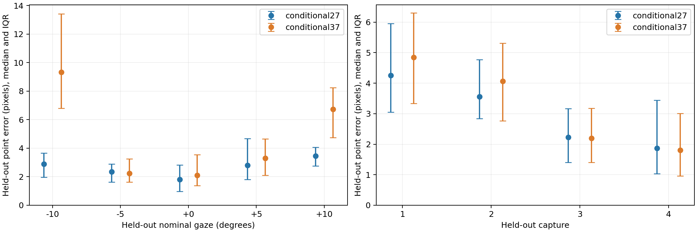
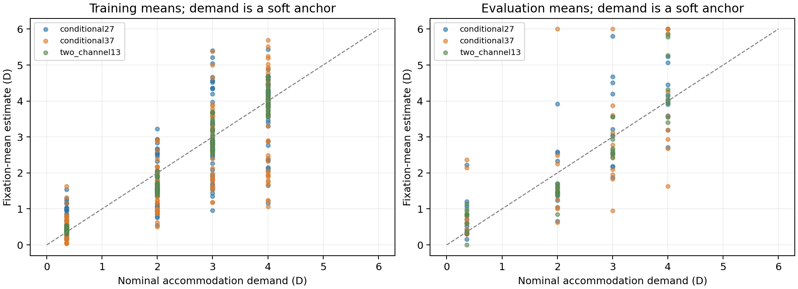

# Initial full-position estimator results

The Python prototype runs and passes synthetic recovery and mathematical checks.
Its first real-data study does **not** establish an improvement over the existing
estimator. `conditional27` generally predicts withheld points better than
`conditional37` in these experiments. Both show substantial model/noise mismatch,
and the acceleration audit exposes a numerical branch-search limitation in the
larger model. Keep the frozen baseline.

## Implementation and experiment

The separate `full_position/` package implements correspondence-safe P1
normalization, both state-dependent coordinate capacities at `theta_deg/10`,
complete shared-input covariance propagation, fixed training-only reference
weights, exact matrix-free variable projection, soft fixation means, bounded
multistart inversion, and all three leakage-safe P4 holdouts. A fresh 13-parameter
summary model is retrained inside every fold. All models use zero temporal
regularization. Original detections and baseline code/coefficients are unchanged.

The primary run withholds each nominal gaze across all four captures (five folds)
and each whole capture/demand (four folds). Each training fixation supplies up to
48 evenly spaced original central-core rows, selected before validity inspection.
Each evaluation fixation supplies eight original rows, including invalid rows.
There are 160 selected rows in each split family; 143 have baseline-valid full
geometry. These two families reuse observations and are not independent samples.
Whole fixations/captures, rather than adjacent frames, determine the splits.

Both capacities are predefined comparisons at prior strength 0.001. This is an
exploratory experiment, **not** nested capacity/prior/noise-policy selection. The
same fold-local pilot defines fixed reference covariances for both capacities.
Calibration uses nominal and perturbed starts; the larger model also receives
the smaller model's converged training states. All 27 fold/model calibrations
produced at least one accepted start. Acceptance includes explicit stationarity
and inner-solve checks; failed starts are retained.

The scalar inverse uses 49 independent starts. No evaluation labels, all-three
warm starts, withheld centroids/areas/maps, or retained-row precision blocks enter
a subset inverse. Branches are selected before scoring excluded coordinates.

## Withheld P4 predictions

Per-gaze medians over testable point predictions, in pixels:

| Held-out nominal gaze | conditional27 | conditional37 |
|---:|---:|---:|
| -10 degrees | 2.88 | 9.33 |
| -5 degrees | 2.35 | 2.23 |
| 0 degrees | 1.80 | 2.09 |
| +5 degrees | 2.79 | 3.30 |
| +10 degrees | 3.44 | 6.72 |

The endpoint rows are extrapolation relative to their fold's remaining gaze
anchors. The larger model improves one interior condition slightly but worsens
endpoint prediction substantially under the initial scalar solver. This cannot
be attributed exclusively to response capacity: priors and numerical branch
search also matter.

For a secondary comparison on exactly matching testable frame/point IDs:

| Split family | Matching point tests | Model | Median error px | RMS error px |
|---|---:|---|---:|---:|
| Gaze | 426 | conditional27 | 2.665 | 3.423 |
| Gaze | 426 | conditional37 | 3.828 | 6.197 |
| Capture/demand | 426 | conditional27 | 3.053 | 4.067 |
| Capture/demand | 426 | conditional37 | 3.105 | 4.354 |

Coverage is reported on the fixed sampled population separately:

| Split family | Model | Estimates / valid full rows | Testable holdouts / attempts | Primary bound hits |
|---|---|---:|---:|---:|
| Gaze | conditional27 | 143 / 143 | 429 / 429 | 10 |
| Gaze | conditional37 | 139 / 143 | 426 / 429 | 31 |
| Capture/demand | conditional27 | 143 / 143 | 429 / 429 | 1 |
| Capture/demand | conditional37 | 142 / 143 | 426 / 429 | 11 |

No primary ambiguity was reported by the initial finite-grid reference. This is
not a proof of global uniqueness; the GPU audit below finds a reference miss.
Invalid rows remain in frame/population outputs. Matching-support errors do not
replace the full coverage and failure reports.

## State and noise diagnostics

Fixation-mean agreement with nominal labels is an internal calibration diagnostic,
not physiological error. RMSE across the 20 evaluated fixation means:

| Split family | Model | Gaze versus nominal, degrees | Accommodation versus demand, D |
|---|---|---:|---:|
| Gaze | conditional27 | 0.761 | 1.135 |
| Gaze | conditional37 | 0.742 | 1.450 |
| Gaze | two_channel13 | 0.564 | 0.536 |
| Capture/demand | conditional27 | 0.500 | 0.849 |
| Capture/demand | conditional37 | 0.706 | 1.218 |
| Capture/demand | two_channel13 | 0.366 | 0.731 |

The new coordinate models do not improve nominal-mean agreement in this study.
The additional geometry often moves accommodation away from its mean anchor.
This may reflect response inadequacy, nuisance/confounded capture effects,
coefficient regularization, effective-noise weighting, or actual accommodation
differences. Demand is not measured accommodation, so these data cannot establish
which explanation is physiological.

Held-out errors are much larger than the provisional short-timescale coordinate
covariance predicts. For `conditional27`, median available squared Mahalanobis
scores are approximately 1,531 in gaze folds and 2,521 in capture folds. These
are **not** validated artifact alarm probabilities. Shared coefficient uncertainty,
systematic model discrepancy, and actual localization-noise independence have
not been established. Gaussian scores are omitted for bound-active subsets.
Per-frame fixed residual covariance, local state covariance where regular, P1
area signal/noise, edge conditioning, and empirical state/context support flags
are available in `frame_uncertainty.json`.

Matched 24-row-per-fixation development runs with and without the coefficient
prior were also attempted. With prior 0.001, all three models produced accepted
fits. Without it, all starts reached their 300-evaluation budgets; those outputs
remain failed checkpoints and were not evaluated as selected models. This shows
an initialization/convergence sensitivity under this computational policy, not
proof that a prior establishes physiological identification.

## Verification and CPU/GPU performance

Twelve acceptance tests pass: normalization/permutation/reconstruction and feature
rank; physical-state and profiled derivatives; fixed Jacobian linearizations;
shared-input covariance including Monte Carlo; subset marginals; leakage checks
for every excluded point/axis; synthetic latent calibration and state recovery;
weak-rank/multiple branches; bounds/invalid-row persistence; area-preserving and
spatially nonlinear distortions; state-like biases; explicit baseline scaling
equivalence; and the batched numerical formulas.

Calibration-kernel measurements were slower with two or four BLAS threads than
with one. Independent folds therefore ran in six separate single-threaded
processes. PyTorch is available, but the first acceleration path uses optional
CuPy to match NumPy arithmetic and analytic derivatives. No extra GPU dependency
is required for the reference estimator.

On the RTX 5070 Ti, the batched 27-coefficient inverse at 1,024 frames took 5.77
seconds with CuPy versus 85.54 seconds with batched NumPy, approximately 14.8x
faster. At 256 frames, timings were 5.65 versus 20.78 seconds. Small GPU batches
were slower. These benchmarks repeat representative input rows for timing; they
are not additional statistical validation observations.

The CuPy forward response and physical derivatives agree with CPU to approximately
`1e-16`. All 32 first 27-coefficient real-data full/subset inverse checks matched
the scalar reference's states, costs, and plausible-branch counts. This is a
tested sample, not a global equivalence guarantee.

The 37-coefficient audit did **not** fully match. GPU candidates supplied usable
solutions for three cases where the reference reported no converged inverse,
and one P4-subset solution had cost 24,441.70 versus the reference's 26,295.89.
CPU trust-region refinement from each of these GPU seeds confirmed convergence
and the GPU costs. Thus finite-grid trust-region paths can miss a better branch
or stop unsatisfactorily. The GPU seed for that subset used only its retained
coordinates. The original main tables remain the scalar-reference results;
acceleration audit results were not silently substituted into them.

## Next improvement experiment

1. Strengthen inverse branch search first. Combine independent CPU/GPU candidate
   generation with CPU refinement and a denser/adaptive development-grid audit.
   Preserve every plausible branch and repeat excluded-coordinate noninterference
   tests. Recompute the larger model's coverage and endpoint predictions before
   attributing all degradation to model capacity.
2. With that inverse fixed, separate model discrepancy from noise/anchor/prior
   effects using grouped training-only sensitivity runs. Inspect point/axis bias,
   signed gaze curvature, accommodation/gaze cross-talk, and residual dependence
   on P1 context. Test supported covariance/reference-state policies and weaker/
   stronger mean anchors and priors. Do not conceal systematic deformation by
   inflating peripheral noise or imposing exact demand.
3. Audit capture-dependent geometry and detector selection. Capture and demand
   are confounded, and stored similarity constraints may suppress deformation.
   Introduce context/nuisance terms only after a rank/support test; compare them
   with the current conditional model inside grouped development splits. Then
   perform nested selection and denser evaluation before using captures 5/6 as
   untouched transfer checks.

No new model replaces the baseline, and no independent physiological accuracy is
claimed. The next decision should be driven by reproducible predictions, state
stability, branch coverage, and uncertainty calibration rather than training loss.

## Artifacts and reproduction

- [Detailed metrics](metrics.csv), [per-point errors](heldout_errors.csv),
  [fixation means](fixation_means.csv), [matched-support summary](matched_holdout_summary.json).
- Each fold/model directory contains `model.json`, `training_states.json`,
  `frames.json`, `frame_uncertainty.json`, `holdouts.jsonl`, `population.csv`,
  `summary.json`, and a determinant audit for coordinate models.
- [Implementation and commands](../../../full_position/README.md).
- GPU checks and CPU-refinement evidence are in sibling `gpu_check27/` and
  `gpu_check37/` directories; thread/batch benchmarks are in the parent directory.

Original source hashes, labels, mapped point order, pilot/noise provenance,
training row/group IDs, software versions, and seeds are saved. The numerical
geometry/model/calibration/inversion code was unchanged during the primary
fits; later additions include reporting, metadata/input validation, uncertainty
enrichment, and GPU diagnostics. Captures 5/6 were not inspected by this study.
